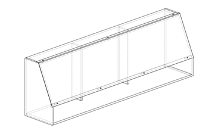
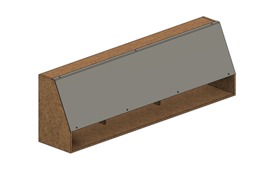
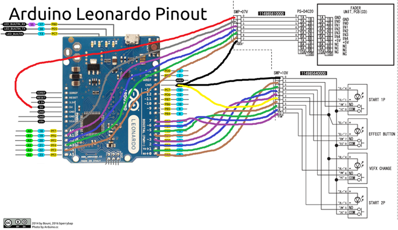

# IIDX-Effector-Conversion
Turn an IIDX Effector Panel into a controller.

Requires 10mm thick wood and a way to cut it.

## Files
| Amount  | Filename  |   Notes   |
| ------------- | ------------- | ------------- |
|2|         `sidepanel.dxf`         ||
|1|         `base.dxf`         ||
|1|         `brace.dxf`          |Any 1000mm long piece of wood will work|
|2|         `beam.dxf`          ||
|1|         `top.dxf`          ||

## Assembly
- Self tapping screws
- M6 Nuts and screws to hold in panel

## Wiring

**For Faders**
|Wire Colour| Connector Pin  | Arduino Pin  |
|-| ------------- | ------------- |
|Red|1|         5V      |
|Grey|2|         A0         |
|Purple|3|         A1        |
|Blue|4|         A2        |
|Green|5|         A3          |
|Brown|6|         A4          |
|Black|7|         GND          |

**For Button and Lights**
|Wire Colour| Connector Pin  | Arduino Pin  |
|-| ------------- | ------------- |
|Black|1|         GND      |
|Brown|2|         0         |
|Green|3|         1        |
|Blue|4|         2        |
|Purple|5|        3          |
|Yellow|6|        GND          |
|Brown|7|          4        |
|Green|8|         5        |
|Blue|9|         6        |
|Purple|10|        7          |

For hooking up the ticker, check out [iidx-twinkIO](https://github.com/KokoseiJ/iidx-twinkIO).

##
This work is licensed under a Creative Commons Attribution-NonCommercial-ShareAlike 4.0 International License.
